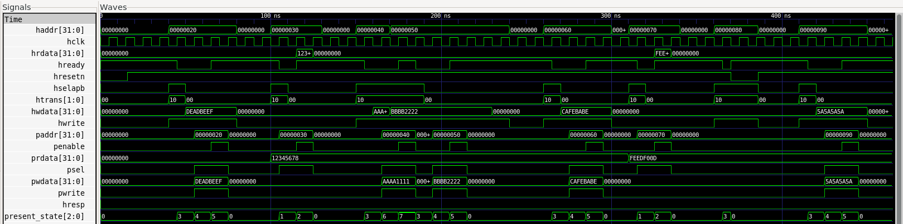

# AHB-APB Bridge — UVM Verification

> Full-pipelined AMBA AHB-to-APB bridge RTL design and complete UVM-based functional verification environment.

---

## Overview

The AHB-APB bridge translates transactions from the high-speed, pipelined Advanced High-performance Bus (AHB) to the low-speed, non-pipelined Advanced Peripheral Bus (APB). This project covers the complete verification lifecycle — RTL design, directed simulation, waveform analysis, and a full UVM environment with scoreboard and functional coverage.

**Tools:** QuestaSim 2019 · SystemVerilog · UVM-1.1d · GTKWave  
**Author:** Appalla Subrahmanya Karthikeya

---

## Repository Structure

```
ahb_apb_bridge_uvm/
├── rtl/
│   └── ahb_apb_bridge.sv        # DUT - full pipelined bridge
├── tb/
│   ├── interfaces/
│   │   └── ahb_apb_if.sv        # SV interface with clocking blocks + SVA
│   ├── txn/
│   │   └── ahb_apb_txn_pkg.sv   # Transaction object with constraints
│   ├── agent_ahb/
│   │   └── ahb_agent_pkg.sv     # AHB sequencer + driver + monitor
│   ├── agent_apb/
│   │   └── apb_agent_pkg.sv     # APB monitor + memory slave model
│   ├── env/
│   │   └── bridge_env_pkg.sv    # Scoreboard + coverage + environment
│   ├── tests/
│   │   └── bridge_test_pkg.sv   # Tests + sequences
│   └── top/
│       ├── tb_top.sv            # Directed testbench top
│       └── tb_uvm_top.sv        # UVM testbench top
├── sim/
│   └── Makefile
└── docs/
    └── waveform_directed_tb.png
```

---

## DUT — AHB-APB Bridge

### Why This Bridge Exists

AHB is a **pipelined** bus — the master sends the address of transfer N+1 while transfer N's data phase is still in progress. APB is **non-pipelined** — it requires a strict 2-phase SETUP→ENABLE handshake and cannot accept a new transfer until the current one completes.

The bridge absorbs the AHB pipeline and serializes transfers into APB's sequential model. It inserts AHB wait states (`hready=0`) while APB completes, then releases the AHB master (`hready=1`).

### FSM — 8 States

```
                    ┌─────────────────────────────────────┐
                    │                                     │
           valid=0  ▼    valid, !hwrite                   │
  hresetn ──► IDLE ──────────────────► READ ──► RENABLE ──┤
               │                                          │
               │ valid, hwrite                            │
               ▼                                          │
             WWAIT ──(!valid)──► WRITE ──► WENABLE ───────┤
               │                                          │
               └──(valid)──► WRITE_P ──► WENABLE_P ───────┘
```

| State | Description |
|-------|-------------|
| `IDLE` | Waiting for valid AHB transfer |
| `WWAIT` | Absorbing AHB pipeline — latches haddr/hwdata for write |
| `READ` | APB SETUP phase for read |
| `RENABLE` | APB ENABLE phase for read — drives hrdata |
| `WRITE` | APB SETUP phase for write (no next transfer) |
| `WENABLE` | APB ENABLE phase for write (no next transfer) |
| `WRITE_P` | APB SETUP phase for write (next transfer pending) |
| `WENABLE_P` | APB ENABLE phase for write (next transfer pending) |

### Key Design Decisions

- **Moore FSM** — outputs depend only on present state, not inputs. Prevents glitches on APB control signals.
- **`always_ff` / `always_comb`** — explicit SV constructs prevent latch inference.
- **`localparam` state encoding** — state values cannot be overridden at instantiation.
- **Address latch in WWAIT** — `haddr_temp`/`hwdata_temp` registers absorb the AHB pipeline. When bridge enters WWAIT, AHB address is captured before the master moves its address bus to the next transfer.
- **AMBA-compliant error response** — 2-cycle `hresp=1` sequence with `hready=0` then `hready=1`.

### Signal Interface

| Signal | Direction | Description |
|--------|-----------|-------------|
| `hclk` | Input | AHB clock |
| `hresetn` | Input | Active-low reset |
| `hselapb` | Input | Slave select |
| `haddr[31:0]` | Input | AHB address |
| `hwrite` | Input | 1=Write, 0=Read |
| `htrans[1:0]` | Input | IDLE/BUSY/NONSEQ/SEQ |
| `hwdata[31:0]` | Input | Write data |
| `hready` | Output | 0=wait state, 1=complete |
| `hresp` | Output | 0=OKAY, 1=ERROR |
| `hrdata[31:0]` | Output | Read data to AHB |
| `paddr[31:0]` | Output | APB address |
| `pwdata[31:0]` | Output | APB write data |
| `psel` | Output | APB peripheral select |
| `penable` | Output | APB enable phase |
| `pwrite` | Output | APB direction |
| `prdata[31:0]` | Input | Read data from peripheral |

---

## Verification Architecture

```
┌─────────────────────────────────────────────────────────┐
│                    bridge_env                           │
│                                                         │
│  ┌──────────────────┐       ┌─────────────────────────┐ │
│  │   ahb_agent      │       │      apb_agent          │ │
│  │  (ACTIVE)        │       │      (PASSIVE)          │ │
│  │                  │       │                         │ │
│  │  ┌────────────┐  │       │  ┌──────────────────┐   │ │
│  │  │ahb_sequencer│ │       │  │   apb_monitor    │   │ │
│  │  └─────┬──────┘  │       │  └────────┬─────────┘   │ │
│  │        │         │       │           │             │ │
│  │  ┌─────▼──────┐  │       │  ┌────────▼─────────┐   │ │
│  │  │ ahb_driver │  │       │  │ apb_slave_model  │   │ │
│  │  └────────────┘  │       │  │  (memory model)  │   │ │
│  │                  │       │  └──────────────────┘   │ │
│  │  ┌────────────┐  │       └────────────┬────────────┘ │
│  │  │ ahb_monitor│  │                    │              │
│  │  └─────┬──────┘  │                    │              │
│  └────────┼─────────┘                    │              │
│           │ ap                           │ ap           │
│           ▼                              ▼              │
│  ┌─────────────────────────────────────────────────┐    │
│  │              bridge_scoreboard                  │    │
│  │   ahb_fifo ◄──────────    apb_fifo ◄─────────   │    │
│  │        └──────── compare() ────────┘           │    │
│  └─────────────────────────────────────────────────┘    │
│                                                         │
│  ┌─────────────────────────────────────────────────┐    │
│  │              bridge_coverage                    │    │
│  │   cg_transfer_type  cg_address  cg_data_corners │    │
│  │   cg_cross          cg_delay                   │    │
│  └─────────────────────────────────────────────────┘    │
└─────────────────────────────────────────────────────────┘
```

### Scoreboard Checks

For every completed transfer, the scoreboard compares AHB monitor vs APB monitor:

| Check | Description |
|-------|-------------|
| Address integrity | `paddr == haddr` — bridge must not modify address |
| Direction preserved | `pwrite == hwrite` |
| Write data integrity | `pwdata == hwdata` — data passed through unchanged |
| Read data integrity | `hrdata == prdata` — peripheral data returned correctly |
| Error response | `hresp` flagged when illegal transfer detected |

### SVA Protocol Assertions (in interface)

```systemverilog
// penable must always follow psel by exactly one cycle
$rose(penable) |-> $past(psel, 1)

// hready must be low during APB SETUP phase
(psel && !penable) |-> !hready

// hrdata must equal prdata during read ENABLE phase
(psel && penable && !pwrite) |-> (hrdata == prdata)

// psel must remain high through penable
$rose(penable) |-> psel
```

---

## Test Plan

| Test | Sequences | Transfers | Description |
|------|-----------|-----------|-------------|
| `smoke_test` | single_write + single_read | 2 | Basic sanity check |
| `write_test` | write_read × 5 | 10 | Write-read pairs at multiple addresses |
| `read_test` | b2b_read × 8 | 8 | Consecutive reads |
| `b2b_test` | b2b_write × 8 + b2b_read × 8 | 16 | Back-to-back pipeline stress |
| `reset_test` | write + mid-transfer reset + write | 2 | Reset recovery |
| `rand_test` | rand × 100 | 100 | Fully randomized |
| `corners_test` | data_corners + rand × 100 | 108 | Corner cases + random |

---

## Results

### Scoreboard — All Tests

| Test | Total Checks | Passed | Failed |
|------|-------------|--------|--------|
| smoke_test | 2 | 2 | 0 |
| write_test | 10 | 10 | 0 |
| read_test | 8 | 8 | 0 |
| b2b_test | 16 | 16 | 0 |
| reset_test | 2 | 2 | 0 |
| rand_test | 100 | 100 | 0 |
| corners_test | 108 | 108 | 0 |
| **TOTAL** | **246** | **246** | **0** |

### Functional Coverage — corners_test

| Coverage Group | Coverage |
|----------------|----------|
| Transfer Type | 75.0% |
| Address Range | 100.0% |
| Data Corners | 100.0% |
| Cross Coverage (kind × address) | 100.0% |
| Delay Coverage | 33.3% |

---

## Waveform

Directed testbench waveform showing all 5 test scenarios with `present_state` annotations:



State transitions verified:

```
Single Write:      0→3→4→5→0   (IDLE→WWAIT→WRITE→WENABLE→IDLE)
Single Read:       0→1→2→0     (IDLE→READ→RENABLE→IDLE)
Back-to-Back Write:0→3→6→7→3→4→5→0  (exercises WRITE_P/WENABLE_P)
Write then Read:   0→3→4→5→0→1→2→0
Reset mid-transfer:3→0         (WWAIT→IDLE on hresetn)
```

---

## How to Run

### Prerequisites
- QuestaSim 2019
- UVM-1.1d (included with QuestaSim)
- GTKWave (for waveform viewing)

### Commands

```bash
cd sim

# Compile RTL only
make compile_rtl

# Compile directed testbench
make compile_directed

# Run directed testbench
make directed

# Compile full UVM environment
make compile

# Run individual tests
make smoke
make write_test
make read_test
make b2b_test
make reset_test
make rand_test
make corners_test

# Run with coverage
make compile_cov
make rand_test

# Clean build artifacts
make clean
```

---

## Key Learnings and Debugging Notes

### AHB Pipeline vs APB Non-Pipeline
The fundamental challenge — AHB sends address N+1 while data N is in flight. The WWAIT state exists specifically to absorb this pipeline difference. The `haddr_temp`/`hwdata_temp` registers hold AHB address-phase data while APB completes the current transfer.

### UVM Driver Timing
The AHB driver must hold `haddr` stable through the WWAIT latch cycle — not deassert it immediately after the address phase. The RTL latches `haddr_temp` at the posedge when `present_state==WWAIT`, so the signal must still be valid at that clock edge.

### Moore vs Mealy FSM
Outputs are purely state-driven (Moore), not dependent on current inputs. This prevents glitches on APB control signals (`psel`, `penable`) which could corrupt peripheral state machines.

### Clocking Block Skew
QuestaSim 2019 clocking block output skew (`#1`) causes signals to arrive 1ns after posedge — too late for RTL to latch correctly. Resolved by driving signals directly on `negedge` from the UVM driver, bypassing clocking block output path.

